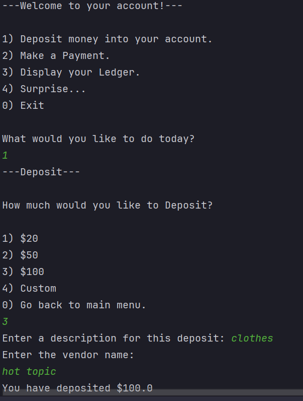
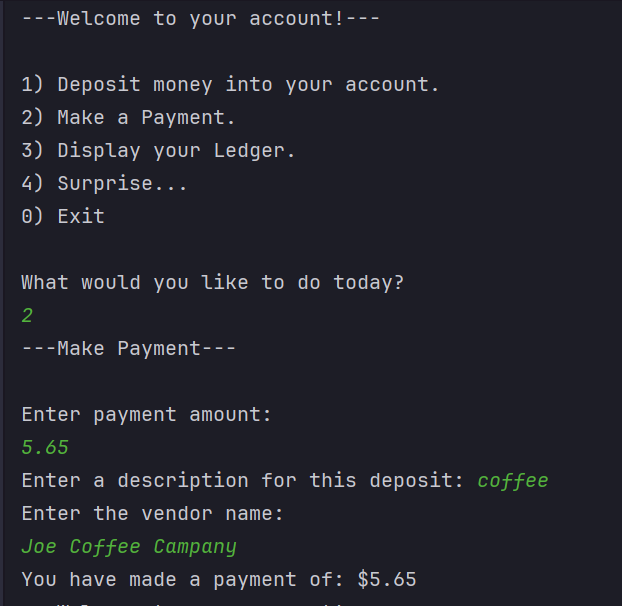
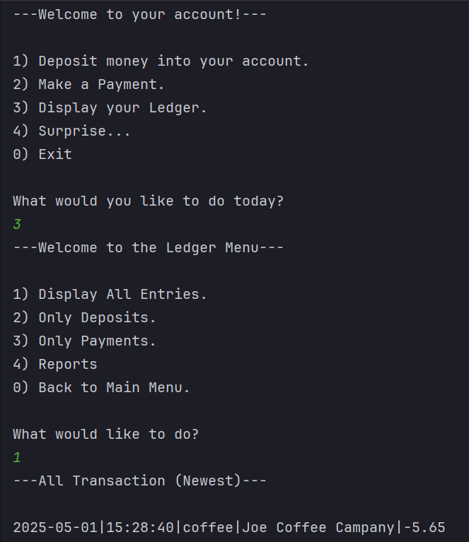

# Accounting Ledger App
A simple console-based java application for managing a personal transaction ledger.This app allows the user to deposit funds, make payments, and generate financial reports. Transactions are saved to and loaded from a CSV file.

## Features

- Deposit money from options or custom amount.
- Make payment and track them.
- View all transactions, deposits, or payments.
- Generate reports:

  - Month-to-Date.
  - Previous Month
  - Year-to-Date.
  - Previous Year.
  - Search by Vendor.
- Data persistence using a 'transactions.csv' file

## How Does It Work?

well...

### Main Menu Options

1. --Deposit Money--
    
    Choose from already made deposit amounts or enter a custom amount. Add a description and vendor name.
2. --Make a Payment--

    Enter a payment amount, description, and vendor. payment are stored as a negative value.
3. --Display Ledger--

    - View all transactions.
    - Filler by deposits or payments.
    - Generate various reports.
    - Search by vendors name.
4. --Exit--

    Gracefully exits the application.

### File Storage

All transactions are stored in a 'transactions.csv' file with the following format:

Date|Time|Description|Vendor|Amount

### Example:

### Describes/shows one interesting piece of code from your project.

The most interesting piece is the surprise. \^u^/

Honestly, I'm really proud of everything I coded. I put a lot of thought into how I organized it, which made the whole development process much smoother and more manageable